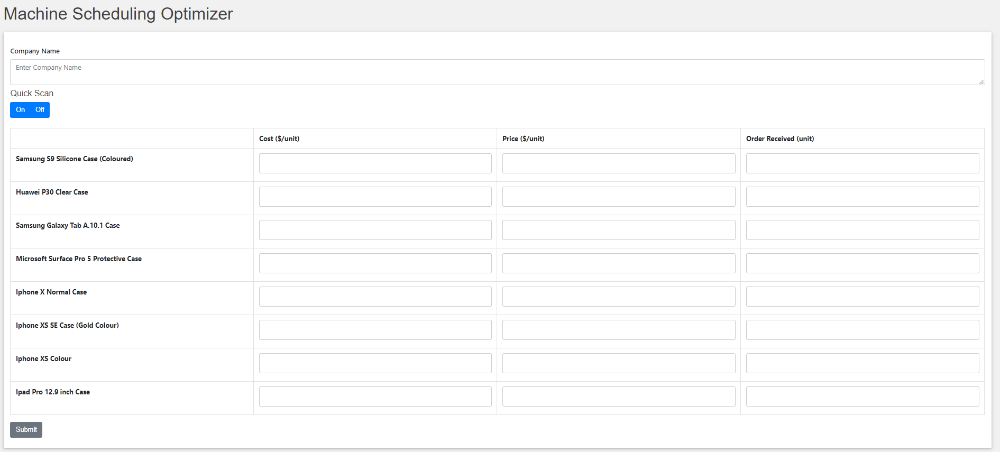

## SECTION 1 : PROJECT TITLE
## 4M1L - Production Scheduling Optimization System



---
## SECTION 2 : EXECUTIVE SUMMARY / PAPER ABSTRACT
Manufacturing sector has been the key pillar of Singapore's strong economy. As manufacturing sector is a capital intensive and cost sensitive industry, Singapore's manufacturing has moved towards high-value added sectors in order to differentiate itself from other cost-competitive countries. Latest Singapore's economy data shows manufacturing sector remains the top GDP contribution sector, contributing approximately 21% of nominal GDP in 2018.

In advanced manufacturing, automation is the key enabler for higher productivity and quality control. As automation requires machine and process synchronization, increasing level of automation also increases the challenge to utilize available resources for maximum throughput with minimum cost. For businesses which adopt high mix low volume manufacturing strategy, the key goal is to determine the best plan that yields highest profit or achieve lowest production cost for high mix design which requires different set of processes respectively.  

Adding other factors like required delivery leadtime, minimum fulfilled quantity, gross margin per order into the equation, it is obvious that human planning and scheduling is no longer efficient and optimized in any possible way. A near real-time production scheduling system becomes a vital solution to address such multi-resource, multi-project problem. A smart scheduling system also increases operation agility to better respond to dynamic business needs. 

For our project, we designed a production scheduling system to optimize the job scheduling for multiple components undergoing various manufacturing processes. Machine capacity, assigned process capability and operating cost are defined in the problem in order to reflect the actual business operations. Our goal is to optimize scheduling problem and maximize profits in the same time. 

---
## SECTION 3 : CREDITS / PROJECT CONTRIBUTION

| Official Full Name  | Student ID (MTech Applicable)  | Work Items (Who Did What) | Email (Optional) |
| :------------ |:---------------:| :-----| :-----|
| Chen Liwei | A0101217B | Video Editing Data Collection Knowledge Modelling| e0384319@u.nus.edu |
| Lee Boon Kien | A0195175W | Video Presentation Data Collection Knowledge Modelling| e0384806@u.nus.edu |
| Ng Cheong Hong| A0195290Y| Knowledge Modelling Rules Engine Programming | e0384921@u.nus.edu |
| Raymond Djajalaksana| A0195381X | Report Writing Front End Programming | e0385012@u.nus.edu |
| Seah Jun Ru| A0097451Y | Data Collection Report Writing Knowledge Modelling| e0258166@u.nus.edu |

---
## SECTION 4 : VIDEO OF SYSTEM MODELLING & USE CASE DEMO

[](http://www.youtube.com/watch?v=kF0tPmweUeU)

---
## SECTION 5 : USER GUIDE

Requirements:
* nodejs and npm should be installed. Otherwise please download and install from the following website: https://www.npmjs.com/get-npm
* To run the backend system, you can just run the binary file (src/go/main.exe). But it is also recommended to always install Golang version 1.12.4 or later. Please follow the installation in https://golang.org/dl/

Installation:
- [Node.js ](https://nodejs.org/en/ "Node.js ")
- [Optional] [Golang](https://golang.org/dl/ "Golang")
``` bash
# 1. install all front end dependenciess
cd SystemCode/company-order-form
npm i react-scripts
npm install

# 2. Run both web app and backend system
start_server.sh # to start backend system
web_app.sh # to start web app
start.sh # to run both start_server.sh and web_app.sh

```

User Guide
`4M1L_User_Guide_CCRS.pdf` : <https://github.com/raycap/IRS-MR-2019-01-19-IS1PT-GRP-4M1L-CCRS/blob/master/UserGuide/4M1L_User_Guide_CCRS.pdf>

---
## SECTION 6 : PROJECT REPORT / PAPER
`4M1L_CreditCardRecommendationReport.pdf` : <https://github.com/raycap/IRS-MR-2019-01-19-IS1PT-GRP-4M1L-CCRS/blob/master/ProjectReport/4M1L_CreditCardRecommendationReport.pdf>

---
## SECTION 7 : MISCELLANEOUS


---


---

**This [Machine Reasoning (MR)](https://www.iss.nus.edu.sg/executive-education/course/detail/machine-reasoning "Machine Reasoning") course is part of the Analytics and Intelligent Systems and Graduate Certificate in [Intelligent Reasoning Systems (IRS)](https://www.iss.nus.edu.sg/stackable-certificate-programmes/intelligent-systems "Intelligent Reasoning Systems") series offered by [NUS-ISS](https://www.iss.nus.edu.sg "Institute of Systems Science, National University of Singapore").**

**Lecturer: [GU Zhan (Sam)](https://www.iss.nus.edu.sg/about-us/staff/detail/201/GU%20Zhan "GU Zhan (Sam)")**

[](https://www.iss.nus.edu.sg/about-us/staff/detail/201/GU%20Zhan)

**zhan.gu@nus.edu.sg**
